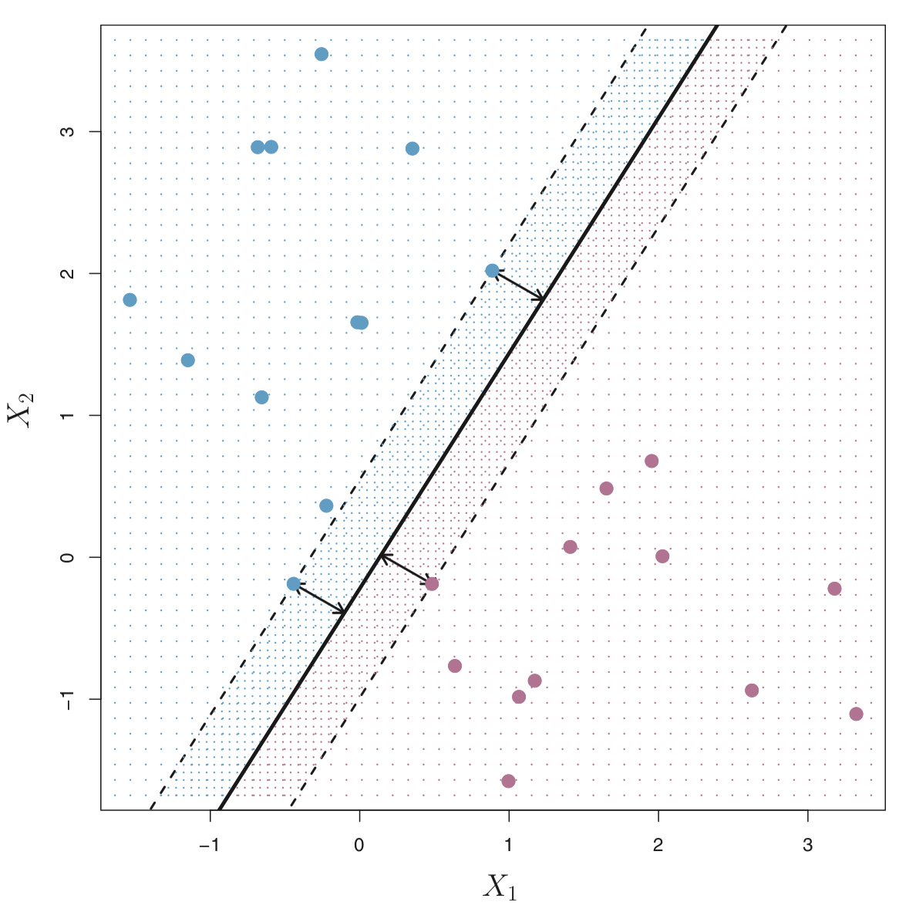
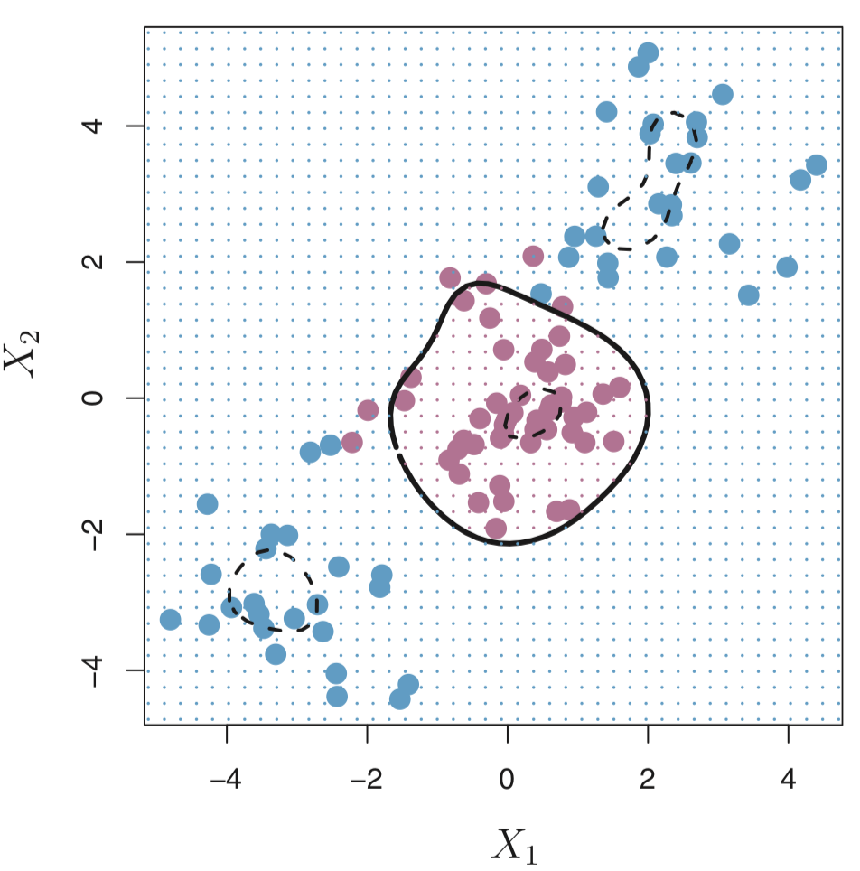
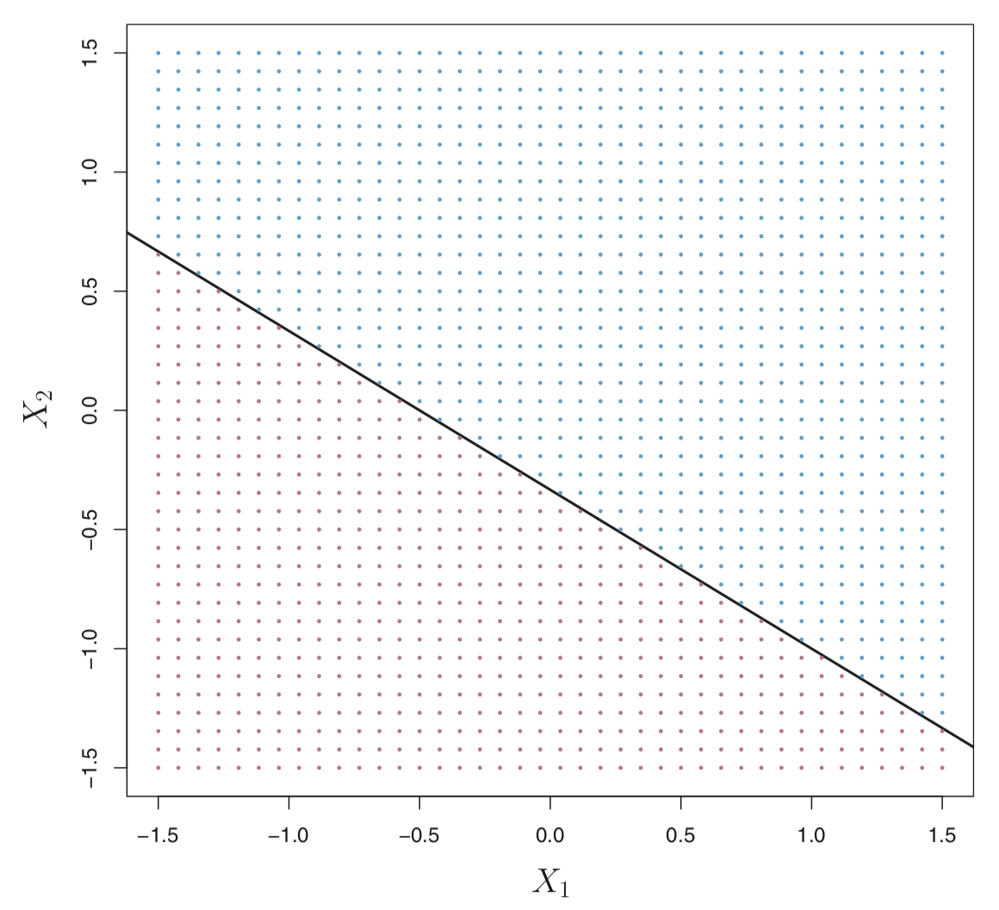
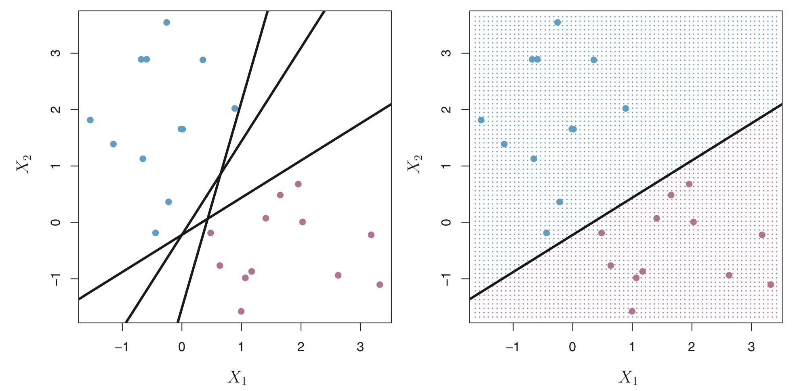
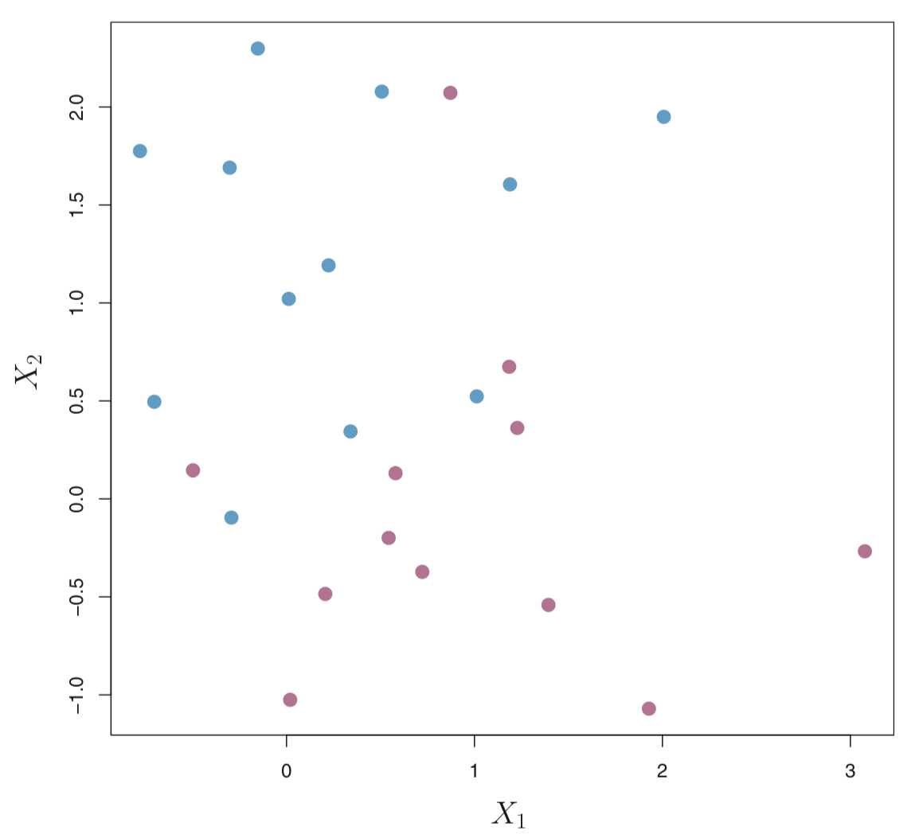
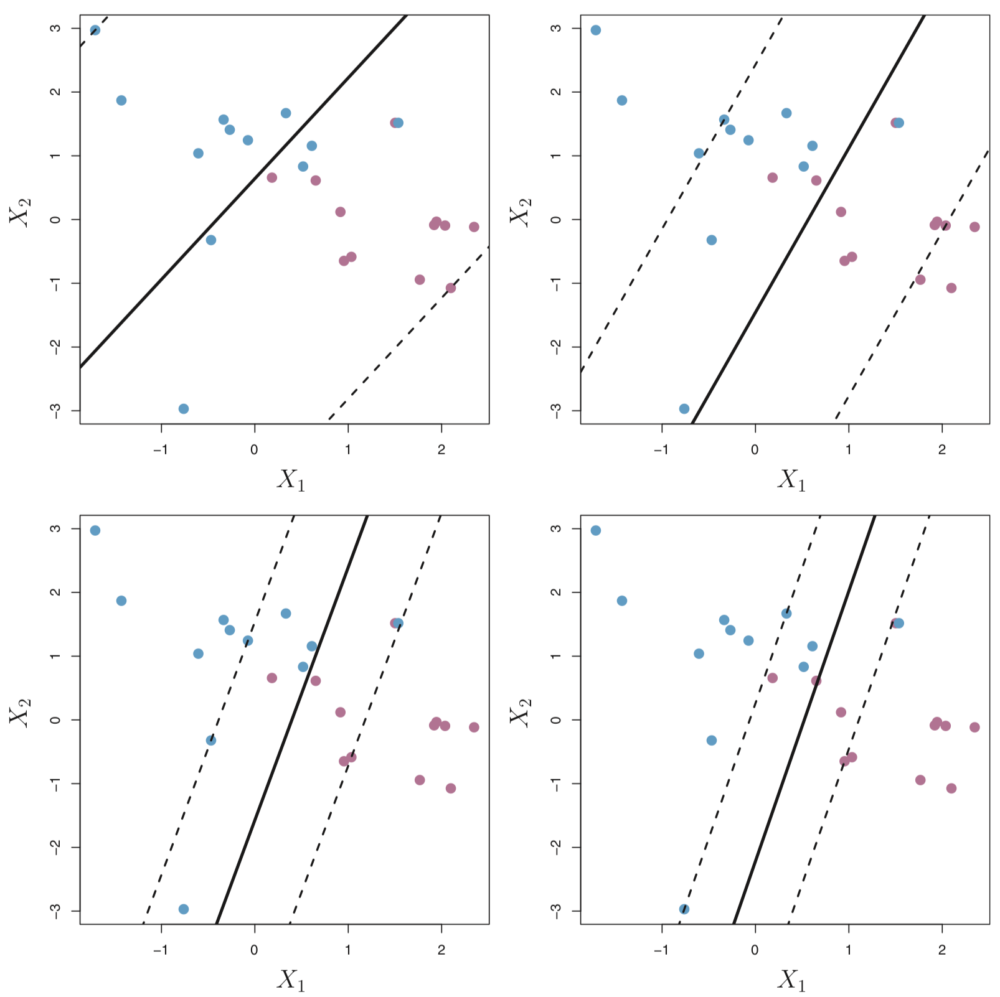
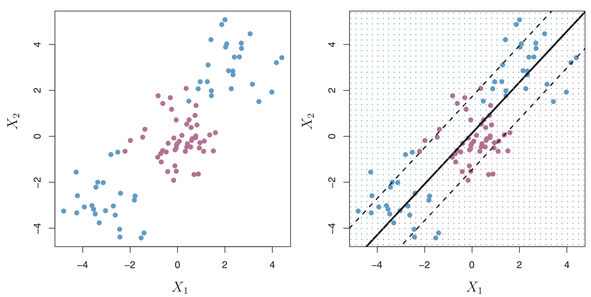
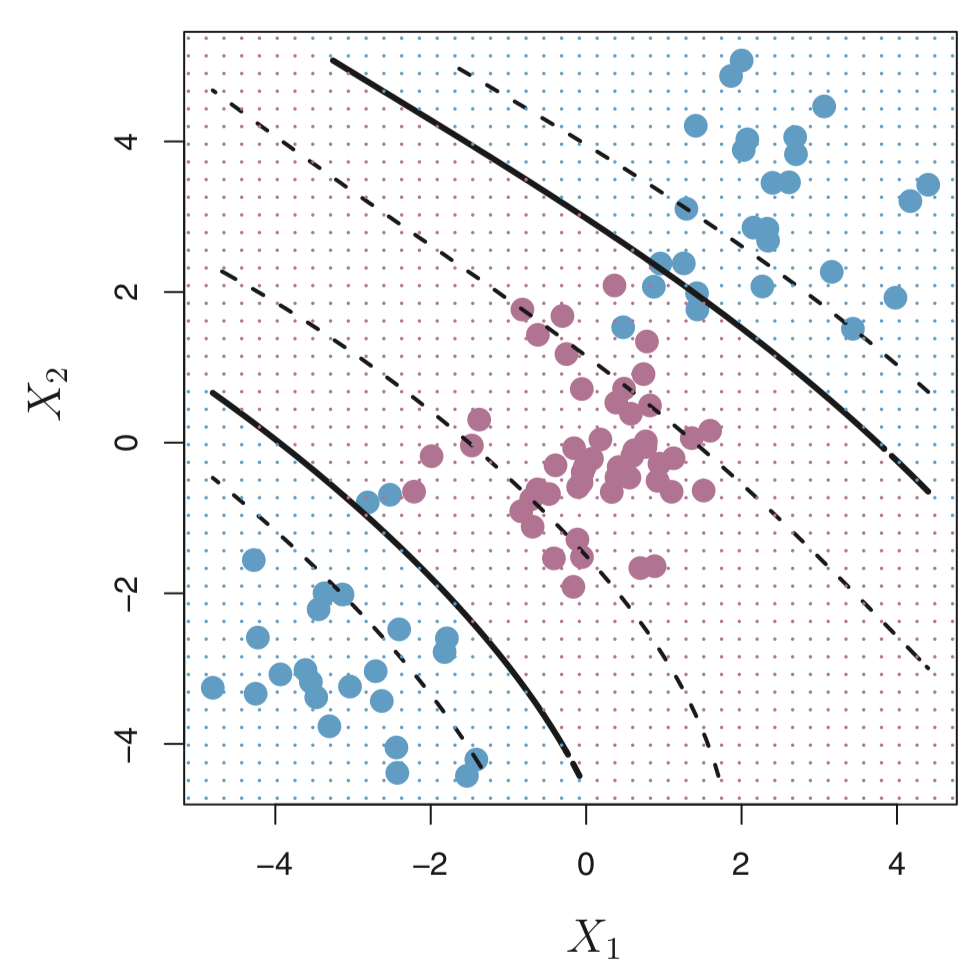

```{r setup, include=FALSE}
knitr::opts_chunk$set(echo = TRUE, 
                      fig.align = "center", 
                      out.width = '70%')
```

First, we load a few R packages
```{r, message=FALSE, warning=FALSE}
library(tidyverse)
library(caret)
library(GGally) ## needs to be installed
```

**Attribution**: A lot of the material for this lecture came from the following resources

* [An Introduction to Statistical Learning, 2013](https://www.springer.com/us/book/9781461471370) by James, Witten, Hastie and Tibshirani


# Motivation

In this lecture, we will be asking the question: 

> Can we identify a voice as male or female, based upon acoustic 
properties of the voice and speech?

```{r, echo=FALSE, out.width = '90%'}
knitr::include_graphics("http://acoustics.org/pressroom/httpdocs/162nd/Images/Elliot_Figure%2014%20-%20Frequency%20ranges%20for%20common%20sounds.jpg")
```

[image source](http://acoustics.org/pressroom/httpdocs/162nd/Images/Elliot_Figure%2014%20-%20Frequency%20ranges%20for%20common%20sounds.jpg)

Determining a person’s gender as male or female, based upon 
a sample of their voice seems to initially be an easy task. 
Often, the human ear can easily detect the difference between 
a male or female voice within the first few spoken words.
However, designing a computer program to do this turns out to
be a bit trickier.

To accomplish that goal, we will learn about another machine
learning algorithmn called _support vector machines_ (SVMs). 
SVMs have been around since the 1990s and originated of 
the computer science community. They are form of supervised
learning 

SVMs are widely applied to pattern classification and 
regression problems, such as: 

1. Handwritten digits classification
2. Speech recognition (Building a model to recognize speech, accept key words and reject non-keywords)
3. Facial expression classification
4. Text classification

The original idea was to build a classifier for which 
training data can be seperated using some type of linear 
hyperplane. We want a hyperplane that maximizes the 
distance between the hyperplane to the nearest data 
point in either class. 

```{r, echo=FALSE}

```

[image source](https://www.springer.com/us/book/9781461471370)


In the case when we cannot draw a linear hyperplane to 
separate the two classes of points (this is more typical), 
we can use adapt the idea and build a non-linear classifer. 
The key idea is to apply a "kernel trick". We'll learn more 
about that later in the lecture. 

```{r, echo=FALSE}

```

[image source](https://www.springer.com/us/book/9781461471370)


**Note**: We will focus on the case when there are only 
two classes, but there are also extensions of SVMs in the 
case when there are more than two classes. 

## How does it work? 

Given a dataset with a set of features and set of labels, 
we want to build a _support vector machine_ (SVMs) to
predict classes for new observations. 

To understand what is a SVM let's build up to it and 
consider some other types of classifiers (or hyperplanes) 
and how it relates to SVMs. First, let's define what is a 
hyperplane. 

### Hyperplanes 

A _hyperplane_ is formally defined as a flat affine subspace
of a dimension $p-1$. e.g. In two dimensions, a hyperplane is
a flat one-dimensional subspace (or a line). In this case, a 
hyperplane is defined by 

$$ \beta_0 + \beta_1 X_1 + \beta_2 X_2 = 0 $$

for $X = (X_1, X_2)^{T}$ and for parameters $\beta_0$, 
$\beta_1$ and $\beta_2$. If there are $X = (X_1, X_2)^{T}$ 
that do not satisify the above, i.e 

$$ \beta_0 + \beta_1 X_1 + \beta_2 X_2 > 0 $$ 

or 

$$ \beta_0 + \beta_1 X_1 + \beta_2 X_2 < 0 $$

Then, we can think of the hyperplane as dividing the 
two-dimensional space into two halves. 

In the figure below, the hyperplane $1 + 2X_1 + 3X_2 = 0$
is shown. The set of points in the blue region is 
$1 + 2X_1 + 3X_2 > 0$ and the purple region is the 
set of points for which $1 + 2X_1 + 3X_2 < 0$. 

```{r, echo=FALSE}

```

[image source](https://www.springer.com/us/book/9781461471370)

More formally, let's say we have a set of $n$ 
training observations $X_i = (X_{i1}, X_{i2})^T$ 
in with two features ($p=2$) and each training 
observation has a known label $y_i \in \{-1,1\}$
where the observations from the blue class are 
labeled as $y_i = 1$ and those from the purple
class are $y_i = -1$. 

A hyperplane that separates the observations

$$ \beta_0 + \beta_1 X_1 + \beta_2 X_2 > 0 \text{ if } y_i = 1 $$ 

or 

$$ \beta_0 + \beta_1 X_1 + \beta_2 X_2 < 0 \text{ if } y_i = -1 $$
or 

$$ y_i (\beta_0 + \beta_1 X_1 + \beta_2 X_2) < 0 \text{ for all } i\in(1, \ldots, n) $$

There can be many hyperplanes that separate these 
points in our example. For example, the figure on the 
left shows three hyperplanes in black (out of many). 
If we pick one hyperplane, the figure on the right 
shows a grid of blue an purple points indicating the 
decision rule made by a classifer defined by this 
hyperplane. 

```{r, echo=FALSE, out.width = '90%'}

```

[image source](https://www.springer.com/us/book/9781461471370)

More formally, we can classify a test observation 
$x^{*}$ based on the sign of of 

$$ f(x^{*}) = \beta_0 + \beta_1 x_1^{*} + \beta_2 x_2^{*} $$ 

* If $f(x^{*})$ is positive, then we assign $x^{*}$ to the blue class. 
* If $f(x^{*})$ is negative, then we assign $x^{*}$ to the purple class. 

In addition to the sign, we can also consider the 
_magnitude_ of $f(x^{*})$. 

* If $f(x^{*})$ is far from zero, then $x^{*}$ is far away from the hyperplane (i.e. more confidence in our class assignment). 
* If $f(x^{*})$ is close to zero, then $x^{*}$ is close to the hyperplane (i.e. less certain about the class assignment for $x^{*}$). 

But, the problem is this still can lead to an infinite 
number of possible separating hyperplanes. How can we 
decide what is the "best" hyperplane? 

### Maximal Margin Hyperplane (or Classifer)

The _maximal margin hyperplane_ is the hyperlane that
separates the farthest from training observations.  

In the figure below, the maximal margin hyperplane 
is shown as a solid line. The margin is the distance 
from the solid line to either of the dashed lines. 
The two blue points and the purple point that lie on 
the dashed lines are the _support vectors_ (they 
"support" the maximal margin hyperplane in the sense
that if these points were moved slightly then the 
maximal margin hyperplane would move as well), and the 
distance from those points to the margin is indicated 
by arrows. The purple and blue grid indicates the 
decision rule made by a classifier based on this 
separating hyperplane.

```{r, echo=FALSE}

```

[image source](https://www.springer.com/us/book/9781461471370)

**Note**: although the maximal margin classifier is often successful,
it can also lead to overfitting when $p$ is large.

To construct a maximal margin classifier using $n$ training 
observations $x_1, \ldots, x_n$ and associated class labels 
$y_1 \ldots, y_n \in \{-1, 1\}$, the maximal margin hyperplane 
is the solution to the optimization problem: 

$$ \text{maximize}_{\beta_0, \beta_1, \ldots, \beta_p} M $$
subject to $\sum_{j=1}^p \beta_j^2 = 1$  and 

$$ y_i (\beta_0 + \beta_1 X_1 + \ldots + \beta_p X_p) \geq M \text{ for all } i\in(1, \ldots, n) $$

This guarantees that each observation will be on the correct
side of the hyperplane and at least a distance of $M$ from 
the hyperplane. Therefore, you can think of $M$ as the 
_margin_ of our hyperplane. 

This works great if _a separating hyperplane exists_. However, 
many times, that isn't true and there is no solution with 
$M > 0$. So instead we can try to find a hyperplane that 
_almost_ separates the classes. 

### Support Vector Classifer

Consider the following data that cannot be separated by a 
hyperplane. 

```{r, echo=FALSE}

```

[image source](https://www.springer.com/us/book/9781461471370)


We could consider building a _support vector classifer_ 
or a _soft margin classifer_ that misclassifies a few 
training observations in order to do a better job of 
classifying the remaining observations. 

The margin is _soft_ because it can be violated by some 
of the training observations. An observation can be 
not only on the wrong side of the margin, but also 
on the wrong side of the hyperplane. 

```{r, echo=FALSE, out.width = '90%'}
knitr::include_graphics("figs/svm_svclassifier.png")
```

[image source](https://www.springer.com/us/book/9781461471370)

On the left there are observations that are on the right side
of the hyperplane, but the wrong side of the margin. On the right
are observations that are on the wrong side of the hyperplane 
and the wrong side of the margin. 

In fact, when there is no separating hyperplane, such a 
situation is inevitable. Observations on the wrong side of
the hyperplane correspond to training observations that are
misclassified by the support vector classifier (i.e. right 
figure above). 

Now, the optimization problem is: 

$$ \text{maximize}_{\beta_0, \beta_1, \ldots, \beta_p, \epsilon_1, \ldots, \epsilon_n} M $$
subject to $\sum_{j=1}^p \beta_j^2 = 1$ 

$$ y_i (\beta_0 + \beta_1 X_1 + \ldots + \beta_p X_p) \geq M (1-\epsilon_i)  $$
for all $i\in(1, \ldots, n)$, $\epsilon_i \geq 0$, 
$\sum_{i=1}^n \epsilon_i \leq C$ where $C$ is a nonnegative
tuning parameter (typically chosen using cross-validation). 
The $\epsilon_1, \ldots, \epsilon_n$ are often called 
_slack variables_ that allow observations to be on the 
wrong side of the margin or hyperplane. 

We won't go into the details, but $C$ basically controls 
the bias-variance trade-off.

* When $C$ is small, we seek narrow margins that are rarely violated; this amounts to a classifier that is highly fit to the data, which may have low bias but high variance. 
* When $C$ is larger, the margin is wider and we allow more violations to it; this amounts to fitting the data less hard and obtaining a classifier that is potentially more biased but may have lower variance.

Interestingly, it turns out that only the observations 
that lie on the margin or that violate the margin 
(also known as _support vectors_) will affect the 
hyperplane (and hence classification). 

This make sense. When $C$ is large, the margin is wide, 
and many observations violate the margin, thus there 
are many support vectors (potentially more bias, but 
less variance). When $C$ is small, the margin is small, 
not many observations violate the margin, thus very 
few support vectors (potentially low bias and high 
variance). 

```{r, echo=FALSE, out.width = '90%'}

```

[image source](https://www.springer.com/us/book/9781461471370)


But what if we want to consider non-linear boundaries? 

### Support Vector Classifier with Non-Linear boundaries 

Consider the following data on the left plot. A 
linear support classifier (applied in the right 
plot) will perform poorly. 

```{r, echo=FALSE, out.width = '90%'}

```

[image source](https://www.springer.com/us/book/9781461471370)

A solution to this problem is to enlarge the 
feature space using functions of the predictors (i.e. 
quadratic and cubic terms or higher) in order to address 
the non-linearity. 

So instead of fitting a support vector classifier with $p$
features $(X_1, X_2, \ldots, X_p)$, we could try using $2p$
features $(X_1, X_1^2, X_2, X_2^2, \ldots, X_p, X_p^2)$. 

#### Why does this lead to a non-linear boundary? 

In the enlarged feature space, the decision boundary that 
is found is still linear. But in the original feature space, 
the decision boundary is of the form $q(x) = 0$, where $q$ is 
a quadratic polynomial, and its solutions are generally 
non-linear. 

As you can imagine, there are many ways to enlarge the feature 
space e.g. include higher-order polynomial terms or interaction
terms such as $X_1 X_2$. We could easily end up with a large 
number of features leading to unmanagable computations. 

In the next section, we will learn about the _support vector machine_
that allows us to enlarge the feature space in an efficient way. 

## Support Vector Machines

The _support vector machine_ (SVM) is an extension of the 
support vector classifier that results from enlarging 
the feature space in a specific way, using _kernels_. 

The details of how exactly how the support vector classifier
is computed is quite technical, so I won't go into here. 
However, it's sufficient to know that the solution to the 
support vector classifier problem involves only the inner
products of the observations (as opposed to the observations
themselves). The inner product of two observations $x_i$ and 
$x_{i^{'}}$ is given by 

$$ \langle x_i, x_{i^{'}} \rangle = \sum_{j=1}^P x_{ij} x_{i^{'}j}$$

For example, the linear support vector classifier can be 
represented as

$$ f(x) = \beta_0 + \sum_{i=1}^n \alpha_i \langle x, x_{i} \rangle $$

where there are $n$ parameters $\alpha_i$ (one per 
training observation). I won't go into the details here. 

However, now suppose that instead of the inner product, we 
consider a generalization of the inner product of the form 

$$ K( x_i, x_{i^{'}} ) $$

where $K$ is some function called a _kernel_. 

You can think of a kernel as a function that 
quantifies the similiarity of two observations. 
For example, 

$$ K( x_i, x_{i^{'}} ) = \sum_{j=1}^p x_{ij} x_{i^{'}j} $$

is a _linear kernel_ (linear in the features) and would
return the support vector classifier. In contrast, 
this kernel is called a _polynomial kernel_ of degree $d$. 
If $d > 1$, then the support vector classifier results 
in a more flexible boundaary. 

$$ K( x_i, x_{i^{'}} ) = \Big(1 + \sum_{j=1}^p x_{ij} x_{i^{'}j} \Big)^d $$

```{r, echo=FALSE}

```

[image source](https://www.springer.com/us/book/9781461471370)


When the support vector classifier is combined with 
non-linear kernels (such as above), the resulting classifier
is known as a _support vector machine_. 

Another popular kernel is the _radial kernel_: 

$$ K( x_i, x_{i^{'}} ) = \exp \Big(-\gamma \sum_{j=1}^p (x_{ij} - x_{i^{'}j})^2 \Big) $$

```{r, echo=FALSE}

```

[image source](https://www.springer.com/us/book/9781461471370)


### Advantages 

1. SVMs are effective when the number of features is quite large.
2. It works effectively even if the number of features are greater than the number of samples.
3. Non-Linear data can also be classified using customized hyperplanes built by using kernel trick.
4. It is a robust model to solve prediction problems since it maximizes margin.

### Disadvantages

1. The biggest limitation of SVMs is the choice of the kernel. The wrong choice of the kernel can lead to an increase in error percentage.
2. With a greater number of samples, it can result in poor performance.
3. SVMs have good generalization performance but they can be extremely slow in the test phase.
4. SVMs have high algorithmic complexity and extensive memory requirements due to the use of quadratic programming.


Let's try out these concepts on the data from our
original question: 

> Can we identify a voice as male or female, based upon acoustic 
properties of the voice and speech?


# Data 

The data we will use is from 
[kaggle](https://www.kaggle.com/primaryobjects/voicegender)
and is available in a `.csv` file. 

A description of the data from Kaggle: 

> "This database was created to identify a voice as 
male or female, based upon acoustic properties of the
voice and speech. The dataset consists of 3,168 recorded 
voice samples, collected from male and female speakers. 
The voice samples are pre-processed by acoustic analysis 
in R using the 
[seewave](https://cran.r-project.org/web/packages/seewave/index.html) and 
[tuneR](https://cran.r-project.org/web/packages/tuneR/index.html)
packages."

We can actually dig a bit deeper and go to the 
[website](http://www.primaryobjects.com/2016/06/22/identifying-the-gender-of-a-voice-using-machine-learning/)
where the data origianlly came from to learn more 
about how the dataset was created: 

> "Each voice sample is stored as a `.WAV` file, which
is then pre-processed for acoustic analysis using the 
specan function from the 
[WarbleR](https://cran.r-project.org/web/packages/warbleR/warbleR.pdf)
R package. Specan measures 22 acoustic parameters on 
acoustic signals for which the start and end times are
provided."

> "The output from the pre-processed WAV files were saved 
into a CSV file, containing 3168 rows and 21 columns 
(20 columns for each feature and one label column for 
the classification of male or female)."

The following acoustic properties of each voice are 
measured ([described on Kaggle's website](https://www.kaggle.com/primaryobjects/voicegender/home)):

Variable    | Description
:-- | :------ 
`meanfreq` | mean frequency (in kHz)
`sd` | standard deviation of frequency
`median` | median frequency (in kHz)
`Q25` | first quantile (in kHz)
`Q75` | third quantile (in kHz)
`IQR` | interquantile range (in kHz)
`skew` | skewness 
`kurt` | kurtosis 
`sp.ent` | spectral entropy
`sfm` | spectral flatness
`mode` | mode frequency
`centroid` | frequency centroid 
`peakf` | peak frequency (frequency with highest energy)
`meanfun` | average of fundamental frequency measured across acoustic signal
`minfun` | minimum fundamental frequency measured across acoustic signal
`maxfun` | maximum fundamental frequency measured across acoustic signal
`meandom` | average of dominant frequency measured across acoustic signal
`mindom` | minimum of dominant frequency measured across acoustic signal
`maxdom` | maximum of dominant frequency measured across acoustic signal
`dfrange` | range of dominant frequency measured across acoustic signal
`modindx` | modulation index. Calculated as the accumulated absolute difference between adjacent measurements of fundamental frequencies divided by the frequency range
`label` | male or female

## Data import

Let's read in the `voice.csv` file into R using 
the `read_csv()` function in the `readr` R 
package. 

```{r}
voice <- read_csv("../data/voice.csv")
voice
```

Next, let's get an overall summary of the range
of values in the dataset. 

```{r}
summary(voice)
```

A quick glimpse over the data shows us that we have 20 
numeric columns with differing ranges and magnitudes. 


## Data wrangling 

It would be nice to get a picture of how these features
are different across the `male` and `female` observations. 
One way to do that is to use `ggplot()` to explore 
differences in distribution with boxplots and histograms. 

First, let's transform the data fraom a wide format
to a long format using the `gather()` function in the 
`tidyr` package. 

```{r}
voice_long <- voice %>% 
  gather(key = feature, value = value, -label)
head(voice_long)
```

We also can transform the `label` column which 
contains `male` and `female` charater strings 
into `1`s and `0`s where `1` represents `male`
and `0` represents `female. 

```{r}
table(voice$label)
```


```{r}
voice_labels <- voice$label

voice <- voice %>% 
  mutate(y = factor(ifelse(label=="male",1,0) )) %>% 
  select(-label)
```

Just as a sanity check: 

```{r}
table(voice_labels, voice$y)
```

Whew ok good! 

## Exploratory data analyses

If we wanted to create boxplots of all twenty 
variables colored by whether the observation 
was male or female, we can use the 
```{r, out.width = '100%'}
voice_long %>%
    ggplot(aes(label, value, colour = label)) + 
        geom_boxplot(alpha = 0.5) + 
        facet_wrap(~ feature, scales='free_y', ncol = 4) + 
        labs(x = NULL, y = NULL) + 
        theme_minimal()
```


```{r, out.width = '100%'}
voice_long %>%
    ggplot(aes(value, fill = label)) + 
        geom_density(alpha = 0.5) + 
        facet_wrap(~ feature, scales='free', ncol = 4) + 
        labs(x = NULL, y = NULL) + 
        theme_minimal()

```

These are great to look at the distributions 
separately, but it would also be good to get an 
idea of how the features are related to each other. 

To do that, another useful plotting function for 
exploratory data analysi is the `ggpairs()`function 
from the `GGally` package: 

```{r, message=FALSE, warning=FALSE, out.width = '100%'}
voice %>% 
  select(IQR, meanfun, Q25, sd, sfm, sp.ent, y) %>%
  ggpairs(ggplot2::aes(colour=factor(y)))

```


# Classification models 

Next, we will build a few models to classify the 
recorded voice samples as male or female using 
features available. First, we will look at SVMs 
and then we will compare to other models that 
we have already seen that are useful for 
classification including logistic regression 
and random forests. 

## Support Vector Machines

Before we build an SVM classifier, let's 
split our data into a `train_set` and 
`test_set` using the `createDataParition()` 
function in the `caret` R package. 

We'll just split it in half for the purposes 
of the lecture. 

```{r}
inTrain <- createDataPartition(y = voice$y,
                               p=0.5)
train_set <- slice(voice, inTrain$Resample1)
test_set <- slice(voice, -inTrain$Resample1)
```
We can look at the dimensions of the two datasets 
to make sure they have been split in half. 
```{r}
dim(train_set)
dim(test_set)
```

And they have! Ok, before we build a SVM using
`train()` function (we've seen this before), 
let's use the `trainControl()` function. Here, 
we select `method=cv` with 10-fold cross-validation. 

```{r}
control <- trainControl(method="cv", 
                        number=10)
metric <- "Accuracy"
```

### SVM with linear kernel 

First, we will use the `train()` function 
from the `caret` R package with the argument 
`method=svmLinear` to build a SVM with linear kernel. 

```{r}
fit_svmLinear <- train(y~., data=train_set, method="svmLinear",
                metric=metric, trControl=control)
fit_svmLinear
```

Now that the SVM has been built on our `train_set`,
we can classify the recorded voice samples in our 
`test_data` using the `predict()` function. 

```{r}
pred_svmLinear <- predict(fit_svmLinear, test_set)
tab <- table(pred=pred_svmLinear, truth=test_set$y)
```

We can also look at the confusion matrix 
and statistics. 
```{r}
conf_matrix <- confusionMatrix(tab)
conf_matrix
```

### SVM with polynomial kernel 

Next, we will use the `train()` function 
from the `caret` R package with the argument 
`method=svmPoly` to build a SVM with 
polynomial kernel. 

```{r}
fit_svmPoly <- train(y~., data=train_set, method="svmPoly",
                metric=metric, trControl=control)
fit_svmPoly
```

Now that the SVM has been built on our `train_set`,
we can classify the recorded voice samples in our 
`test_data` using the `predict()` function. 

```{r}
pred_svmPoly <- predict(fit_svmPoly, test_set)
tab <- table(pred=pred_svmPoly, truth=test_set$y)
```

We can also look at the confusion matrix 
and statistics. 
```{r}
conf_matrix <- confusionMatrix(tab)
conf_matrix
```


### SVM with radial basis kernel 

Next, we will use the `train()` function 
from the `caret` R package with the argument 
`method=svmRadial` to build a SVM with 
radial basis kernel. 

```{r}
fit_svmRadial <- train(y~., data=train_set, method="svmRadial",
                       metric=metric, trControl=control)
fit_svmRadial
```

Now that the SVM has been built on our `train_set`,
we can classify the recorded voice samples in our 
`test_data` using the `predict()` function. 

```{r}
pred_svmRadial <- predict(fit_svmRadial, test_set)
tab <- table(pred=pred_svmRadial, truth=test_set$y)
```

We can also look at the confusion matrix 
and statistics. 
```{r}
conf_matrix <- confusionMatrix(tab)
conf_matrix
```

## Logistic regression

Now let's compare to some other classification 
approaches that we have learned about. 

First, let's try logistic regression. 

```{r, warning=FALSE}
fit_glm <- train(y ~ ., data = train_set, trControl = control, 
                 method = 'glm', family = 'binomial')
summary(fit_glm)
pred_glm <- predict(fit_glm, newdata = test_set)
tab <- table(pred=pred_glm, truth= test_set$y)
conf_matrix <- confusionMatrix(tab)
conf_matrix
```

That's actually not so bad. 


## Random Forests

Next let's try random forests. 

```{r}
fit_rf <- train(y~., data=train_set, method="rf", 
                metric=metric, trControl=control)
pred_rf <- predict(fit_rf, test_set)
tab <- table(pred=pred_rf, truth=test_set$y)
conf_matrix <- confusionMatrix(tab)
conf_matrix
```

I'm forgetting where the performance of a random 
forest model compared to everyone else. So let's 
take a closer look. 

```{r, eval=FALSE}
mods <- resamples(list(lr_processed = lr_processed, lr_unprocessed = lr_unprocessed, rf_processed = rf_processed, rf_unprocessed = rf_unprocessed, svm_processed = svm_processed, svm_unprocessed = svm_unprocessed))
summary(mods)
```

```{r}
# summarize results
class_results <- resamples(list(glm=fit_glm, rf=fit_rf, 
                  fit_svmLinear=fit_svmLinear, fit_svmPoly=fit_svmPoly, 
                  fit_svmRadial=fit_svmRadial))
summary(class_results)
```

```{r}
dotplot(class_results)
```

So it looks like SVM does give us a bit of a performance 
boost over logistic regression or random forests. 

What about bagging or boosting? I will leave it for you to try! 