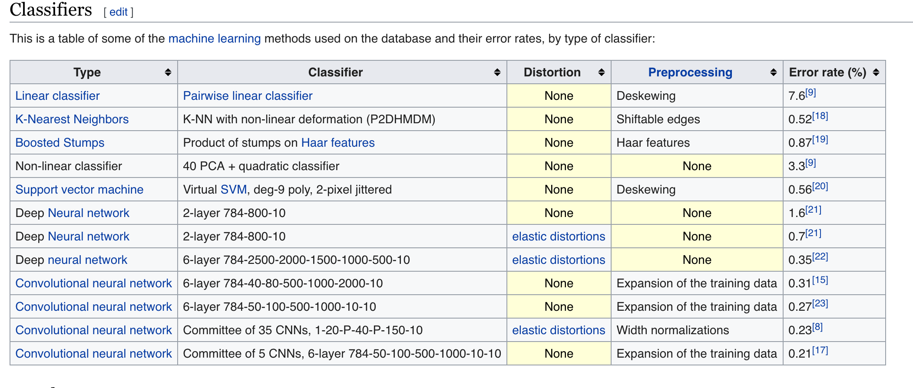
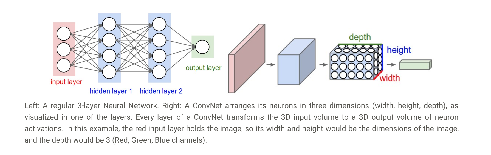
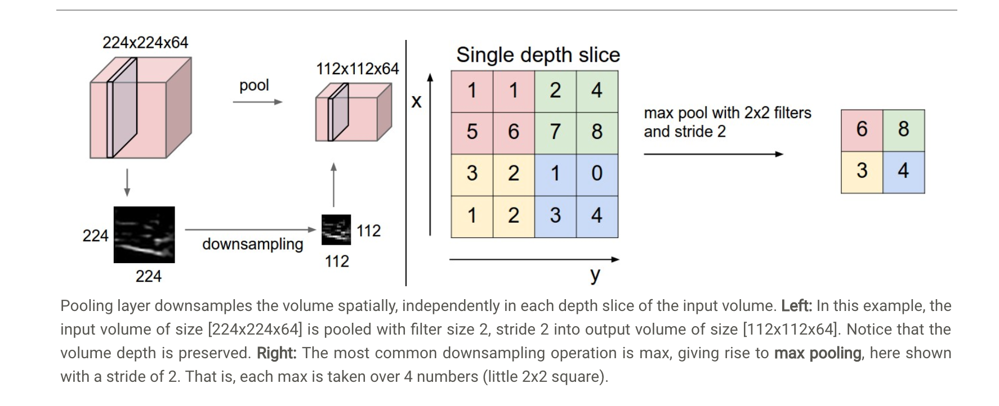

```{r setup, include=FALSE}
knitr::opts_chunk$set(echo = TRUE, comment = NA)
```

**Attribution**: A lot of the material for this lecture came from the following resources

* [Deep Learning with R] (https://proquestcombo-safaribooksonline-com.proxy1.library.jhu.edu/9781786467416) by Vincenzo Lomonaco;
* [The Elements of Statistical Learning] (https://link.springer.com/book/10.1007%2F978-0-387-84858-7) by Trevor Hastie, Robert Tibshirani, Jerome Friedman;
* [Neural Networks and Deep Learning] (http://neuralnetworksanddeeplearning.com/index.html) by Michael Nielsen; 
* [CS231n Convolutional Neural Networks for Visual Recognition (A Stanford CS class)](http://cs231n.github.io/)  

# Motivation

```{r, echo=FALSE, out.width = '90%'}
knitr::include_graphics("https://upload.wikimedia.org/wikipedia/commons/2/27/MnistExamples.png")
```

[image source](https://upload.wikimedia.org/wikipedia/commons/2/27/MnistExamples.png)


Many classifiers has been applied to read the hand-written digits. 
```{r, echo=FALSE, out.width = '90%'}

```

[image source](https://en.wikipedia.org/wiki/MNIST_database#Performance)


In this lecture, we will explore one of the most sucessful classification 
methods (i.e. lost error rate) -- **Deep learning (aka Neural Network)**.

# Fundamental Concepts in Deep Learning

Deep Learning is a branch of machine learning based on a set of algorithms
that attempt to model high level and hierarchical representations in data using: 

  1. Deep graph with multiple processing layers;
  2. multiple linear and non-linear transformations.
  
Basic assumptions:

  1. We can learn from the data everything we need to solve the task;
  2. Employing a large number of very simple computational units, we can 
  solve even complex problems.
  
  
# (Artificial) Neural Networks(ANN)
## The perceptron Algorithm -- Fundamental computational unit at the heart of 
every Deep Learning model which is invented in 1957 by Frank Rosenblatt. 
```{r, echo=FALSE, out.width = '90%'}
knitr::include_graphics("https://cdn-images-1.medium.com/max/1600/1*Fyapb-JRFJ-VtnLYLLXCwg.png")
```

[image source](https://cdn-images-1.medium.com/max/1600/1*Fyapb-JRFJ-VtnLYLLXCwg.png)

For example, you can think of logistic regression as a special case of neural networks.
```{r, echo=FALSE, out.width = '90%'}
knitr::include_graphics("https://i.stack.imgur.com/bA57S.png")
```

[image source](https://i.stack.imgur.com/bA57S.png)


## Multilayer Perceptron(MLP)

The Single layer perceptron has difficulty to distinguish non-linearly separable data. 
One solution is to modify this model by introducing *hidden* layers between the input and output layers.
This model is called **Multilayer Perceptron**. Ideally, MLP is a universal approximator for any function. 
Why and how? [Reference] (http://neuralnetworksanddeeplearning.com/chap4.html#universality_with_one_input_and_one_output)


```{r, echo=FALSE, out.width = '90%'}
knitr::include_graphics("figs/single_hidden_layer.png")
```

[image source](https://link.springer.com/book/10.1007%2F978-0-387-84858-7)

## Mathematical Details

A neural network is a two-stage regression or classification model, This network
applies both to regression or classification. For regression, typically $K = 1$
and there is only one output unit $Y_1$ at the top. However, these networks
can handle multiple quantitative responses in a seamless fashion, so we will
deal with the general case.

For K-class classification, there are $K$ units at the top, with the kth
unit modeling the probability of class k. There are $K$ target measurements
$Y_k$, $k = 1,\cdots,K$, each being coded as a 0 − 1 variable for the kth class.
Derived features $Z_m$ are created from linear combinations of the inputs,
and then the target $Y_k$ is modeled as a function of linear combinations of
the $Z_m$,

$$
\begin{aligned}
    Z_m &= \sigma(\alpha_{0m}+\alpha^TX), m = 1,\cdots,M,\\
    T_k &= \beta_{0k} +\beta_k^TZ, k = 1,\cdots, K,\\
    f_k(X) &= g_k(T),k = 1,\cdots, K,
\end{aligned}
$$

where $Z = (Z_1, Z_2,...,Z_M)$, and $T = (T_1, T_2,...,T_K)$.


The output function $g_k(T)$ allows a final transformation of the vector of
outputs T. For regression we typically choose the identity function $g_k(T) =
T_k$. Early work in K-class classification also used the identity function, but
this was later abandoned in favor of the *softmax* function
$$
g_k(T) = \frac{e^{T_k}}{\sum_{l=1}^Ke^{T_l}}

$$


## Fitting Neural Networks

### Loss function
We first need to define our measure of fit (a.k.a loss function or cost function).
As for the choice of the loss function many different loss functions can be designed
for the same problem.
An example of loss function for regression problem could be sum-of-squared errors, 

$$
C(\theta) = \sum_{i=1}^n (y_i - f(x_i,\theta))^2. 
$$
Typically we don’t want the global minimizer of $C(θ)$, as this is likely
to be an overfit solution. Instead some regularization is needed: this is
achieved directly through a penalty term, or indirectly by early stopping. 

### Backpropogation

Let us recall gradient descent.
```{r, echo=FALSE, out.width = '90%'}
knitr::include_graphics("http://neuralnetworksanddeeplearning.com/images/valley_with_ball.png")
```

[image source](http://neuralnetworksanddeeplearning.com/images/valley_with_ball.png)

let's think about what happens when we move the ball a small amount $\Delta v_1$ 
in the $v_1$ direction, and a small amount $\Delta v_2$ in the $v_2$ direction. 
Calculus tells us that Cost function changes as follows:

$$
\begin{eqnarray} 
  \Delta C \approx \frac{\partial C}{\partial v_1} \Delta v_1 +
  \frac{\partial C}{\partial v_2} \Delta v_2 \equiv \nabla C \cdot \Delta v, 
\end{eqnarray}
$$
where $\nabla C \equiv \left( \frac{\partial C}{\partial v_1}, \frac{\partial C}{\partial v_2} \right)^T$, 
$\Delta v \equiv (\Delta v_1, \Delta v_2)^T$. 

Then we want to move the ball to a new position $v'$,
$$
\begin{eqnarray}
  v \rightarrow v' = v -\eta \nabla C, 
\end{eqnarray}
$$
where $\eta$ is the a small, positive parameter (known as the *learning rate*).  
Another sight of this equation is that change $\Delta C$ in the cost is related 
to the change $\Delta v$ in position $v$. 
Now, back to our neural network,

```{r, echo=FALSE, out.width = '90%'}
knitr::include_graphics("http://neuralnetworksanddeeplearning.com/images/tikz22.png")
```

[image source](http://neuralnetworksanddeeplearning.com/)

```{r, echo=FALSE, out.width = '90%'}
knitr::include_graphics("http://neuralnetworksanddeeplearning.com/images/tikz23.png")
```

[image source](http://neuralnetworksanddeeplearning.com/)

```{r, echo=FALSE, out.width = '90%'}
knitr::include_graphics("http://neuralnetworksanddeeplearning.com/images/tikz25.png")
```

[image source](http://neuralnetworksanddeeplearning.com/)

$$
  \Delta C \approx \sum_{mnp\ldots q} \frac{\partial C}{\partial a^L_m} 
  \frac{\partial a^L_m}{\partial a^{L-1}_n}
  \frac{\partial a^{L-1}_n}{\partial a^{L-2}_p} \ldots
  \frac{\partial a^{l+1}_q}{\partial a^l_j} 
  \frac{\partial a^l_j}{\partial w^l_{jk}} \Delta w^l_{jk}.
$$

This is exactly the chain rule for computing the derivative of the 
composition of two or more functions. 

This is called backpropagation which essentially applied the gradient
descent algorithm. The backpropagation algorithm is a clever way of
keeping track of small perturbations to the weights (and biases) as 
they propagate through the network, reach the output, and then affect the cost.

For ANNs we have many hyper-parameters to tune and this is often pointed out as 
the major downside of these models:

* Number of hidden layers
* Number of hidden units
* Number of training iterations
* Learning rate
* Regularization

###Overfitting

Often neural networks have too many weights and will overfit the data at
the global minimum of R. In early developments of neural networks, either
by design or by accident, an early stopping rule was used to avoid overfitting.
Here we train the model only for a while, and stop well before we
approach the global minimum. Since the weights start at a highly regularized
(linear) solution, this has the effect of shrinking the final model toward
a linear model. A validation dataset is useful for determining when to stop,
since we expect the validation error to start increasing.

A more explicit method for regularization is weight decay, which is analogous
to ridge regression used for linear models. We add a
penalty to the error function

$$
C(\theta) + \lambda ||\theta||^2,
$$ 
where $\lambda\geq 0$ is a tuning parameter.


## Example

### Data

The data we will use is from
[Kaggle] (https://www.kaggle.com/c/digit-recognizer/data)
and is available in a `.csv` file.

A description of the data from Kaggle: 

>"The dataset was constructed from a number of scanned document dataset
available from the National Institute of Standards and Technology (NIST).
This is where the name for the dataset comes from, as the Modified NIST 
or MNIST dataset."

>"Images of digits were taken from a variety of scanned documents, normalized
in size and centered. This makes it an excellent dataset for evaluating models, 
allowing the developer to focus on the machine learning with very little data
cleaning or preparation required."

>"Each image is a 28 by 28 pixel square (784 pixels total). A standard spit 
of the dataset is used to evaluate and compare models, where 60,000 images
are used to train a model and a separate set of 10,000 images are used to test it."

>"It is a digit recognition task. As such there are 10 digits (0 to 9) or 10 
classes to predict. Results are reported using prediction error, which is 
nothing more than the inverted classification accuracy."

```{r}
library(h2o)
h2o.init()
dat = read.csv("../data/train.csv")
dat$label = as.factor(dat$label)
train = dat[1:5000,]
test = dat[5001:10000,]
validation = dat[10001:15000, ]

train.h2o = as.h2o(train)
test.h2o = as.h2o(test)
str(train)

model = h2o.deeplearning(x = 2:785, y = 1,
                         training_frame = train.h2o,
                         hidden = c(5),
                         seed = 0)
h2o.confusionMatrix(model, test.h2o)
```

# Convolutional Neural Network

As we saw in the previous sections, regular neural networks receive an input (a single vector), 
and transform it through a series of hidden layers. However, one of the main drawbacks of regular
neural networks is that:

* Regular Neural Nets don’t scale well to full images.Let's say we have to classify images of size 
$32\times32\times3$ (32 wide, 32 high, 3 color channels), so a single fully-connected neuron in a first hidden 
layer of a regular Neural Network would have $32\times32\times3 = 3072$ weights. This amount still 
seems manageable, but clearly this fully-connected structure does not scale to larger images.
For example, an image of more respectable size, e.g. $200\times200\times3$, would lead to neurons that have 
$200\times200\times3 = 120,000$ weights. Moreover, we would almost certainly want to have several 
such neurons, so the parameters would add up quickly! Clearly, this full connectivity is wasteful 
and the huge number of parameters would quickly lead to overfitting.

Convolutional Neural Networks take advantage of the fact that the input consists of images and 
they constrain the architecture in a more sensible way. In particular, unlike a regular Neural Network, 
the layers of a ConvNet have neurons arranged in 3 dimensions: width, height, depth. (Note that the word 
depth here refers to the third dimension of an activation volume, not to the depth of a full Neural Network, 
which can refer to the total number of layers in a network.) Here is a visualization:


```{r, echo=FALSE, out.width = '90%'}

```

[image source](http://cs231n.github.io/convolutional-networks/)


We can see a CNN as a sequence of layers, where each layer transforms one volume
of activations to another through a differentiable function. There are three 
fundamental types of layers:

 * Convolutional Layer -- compute the output of neurons that are connected to
 local regions in the input, each computing a dot product between their weights
 and a small region they are connected to in the input volume. 
 This may result in volume such as [32x32x12] if we decided to use 12 filters.
 * RELU layer -- apply an elementwise activation function, such as the $max(0,x)$
 thresholding at zero. This leaves the size of the volume unchanged ([32x32x12]).
 * Pooling Layer -- perform a downsampling operation along the spatial
 dimensions (width, height), resulting in volume such as [16x16x12].
 * Fully-Connected Layer -- compute the class scores, resulting in volume of
 size [1x1x10], where each of the 
 10 numbers correspond to a class score, for example. As with ordinary Neural
 Networks and as the name implies, each neuron in this layer will be connected
 to all the numbers in the previous volume.
 
 
## Convoluntional Layer

In computer vision, a very typical approach for processing an image is to
convolve it with a filter (or kernel) in order to extract only salient 
features from the image. 

```{r, echo=FALSE, out.width = '90%'}

```

[image source](https://jeiwan.cc/images/convolution-filter-example.png)

More specifically, 
```{r, echo=FALSE, out.width = '90%'}
knitr::include_graphics("https://www.saama.com/wp-content/uploads/2017/12/01.jpg")
```

[image source](https://www.saama.com/wp-content/uploads/2017/12/01.jpg)


```{r, echo=FALSE, out.width = '90%'}
knitr::include_graphics("figs/convlayer.png")
```

[image source](http://cs231n.github.io/convolutional-networks/)

We need more than one output feature maps, because each filter can extract different 
features from the input image. The number of feature maps for each conv. layer 
would be anther hyper-parameter to tune. 

## Polling Layer

It is common to periodically insert a Pooling layer in-between successive Conv layers
in a ConvNet architecture. Its function is to progressively reduce the spatial size of
the representation to reduce the amount of parameters and computation in the network, 
and hence to also control overfitting. 

The Pooling Layer operates independently on every depth slice of the input and resizes
it spatially, using the MAX operation. The most common form is a pooling layer with 
filters of size 2x2 applied with a stride of 2 downsamples every depth slice in the 
input by 2 along both width and height, discarding 75% of the activations. Every MAX 
operation would in this case be taking a max over 4 numbers (little 2x2 region in some 
depth slice). The depth dimension remains unchanged. 


```{r, echo=FALSE, out.width = '90%'}

```

[image source](http://cs231n.github.io/convolutional-networks/)


## Fully-Connected Layer

Neurons in a fully connected layer have full connections to all activations in the previous
layer, as seen in regular Neural Networks. Their activations can hence be computed with a
matrix multiplication followed by a bias offset. See the Neural Network section of the notes
for more information.


## Layer Patterns
The most common form of a ConvNet architecture stacks a few CONV-RELU layers, follows
them with POOL layers, and repeats this pattern until the image has been merged
spatially to a small size. At some point, it is common to transition to fully-connected
layers. The last fully-connected layer holds the output, such as the class scores. 
In other words, the most common ConvNet architecture follows the pattern:

`INPUT -> [[CONV -> RELU]*N -> POOL]*M -> [FC -> RELU]*K -> FC`.

Moreover, $N \geq 0$ (and usually $N \leq 3$), $M \geq 0$, $K \geq 0$ (and usually $K < 3$).


## Example

We are using the same MNIST dataset that we introduced before, but applying
the CNN. 

Here we are introducing another commonly useful R package `mxnet` for CNN.
The installation manual can be found [here] (https://en.wikipedia.org/wiki/MNIST_database#Performance).

```{r install mxnet, include=FALSE, eval=FALSE}
##install mxnet refer to https://mxnet.incubator.apache.org/install/index.html?platform=MacOS&language=R&processor=CPU
  cran <- getOption("repos")
  cran["dmlc"] <- "https://apache-mxnet.s3-accelerate.dualstack.amazonaws.com/R/CRAN/"
  options(repos = cran)
  install.packages("mxnet")
```

```{r mxnet}
detach("package:h2o", unload=TRUE)
library(mxnet)
library(caret)


data = read.csv("../data/train.csv", header = T)
dim(data)

train = data.matrix(data[1:5000, ])
test = data.matrix(data[5001:10000, ])

train.x = train[,-1]
train.y = train[,1]
test.x = test[,-1]
test.y = test[,1]

# normalize each value to 0-1
train.x = t(train.x/255)
test.x = t(test.x/255)


# input 
data = mx.symbol.Variable('data')
#first conv
conv1 = mx.symbol.Convolution(data = data, kernel = c(5,5), num_filter = 20)
tanh1 = mx.symbol.Activation(data = conv1, act_type = "tanh")
pool1 = mx.symbol.Pooling(data = tanh1, pool_type = "max", kernel = c(2,2), stride = c(2,2))
#second conv
conv2 = mx.symbol.Convolution(data = pool1, kernel = c(5,5), num_filter = 50)
tanh2 = mx.symbol.Activation(data = conv2, act_type = "tanh")
pool2 = mx.symbol.Pooling(data = tanh2, pool_type = "max", kernel = c(2,2), stride = c(2,2))
#first fullc
flatten = mx.symbol.flatten(data = pool2)
fc1 = mx.symbol.FullyConnected(data = flatten, num_hidden = 500)
tanh3 = mx.symbol.Activation(data = fc1, act_type = "tanh")
#second fullc
fc2 = mx.symbol.FullyConnected(data = flatten, num_hidden = 10)
#loss
lenet = mx.symbol.SoftmaxOutput(data = fc2)

#reshape the matrices into arrays
train.array = train.x
dim(train.array) = c(28,28,1,ncol(train.x))

test.array = test.x
dim(test.array) = c(28,28,1,ncol(test.x))

#train the CNN

mx.set.seed(0)
tic = proc.time()
model = mx.model.FeedForward.create(lenet, X = train.array, y =train.y,
                                    num.round = 10, array.batch.size = 100, 
                                    ctx = mx.cpu(), learning.rate = 0.05, momentum = 0.9,
                                    wd = 1e-5, eval.metric = mx.metric.accuracy,
                                    epoch.end.callback = mx.callback.log.train.metric(100))

preds = predict(model, test.array)
dim(preds)

pred = apply(preds, 2, which.max)
pred = pred - 1
caret::confusionMatrix(as.factor(pred), as.factor(test.y))
```


# Outside R platforms

```{r, echo=FALSE, out.width = '90%'}

```

```{r, echo=FALSE, out.width = '90%'}

```

```{r, echo=FALSE, out.width = '90%'}

```

# Summary

* Deep learning is blending logistic regressions
* Can be used to do different things
    + Encode
    + Compete
    + Predict
* Artificial still requires a lot of human intervention
